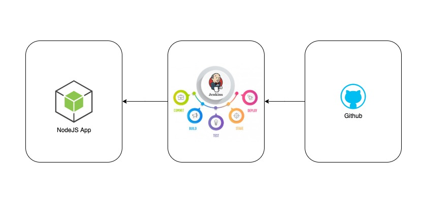

# How to configure a CI/CD for a NodeJS App with Jenkins using Droplet's at Digital Ocean

## What are we going to build?

We are going to build two applications, Node application, and Jenkins App, and host it on DigitalOcean instance. 
Jenkins will help us to automate the CI/CD process. On every code change from our Node app repository, Jenkins will get notified and it will pull the changes into our Jenkins Server, install dependencies and run all tests. If all tests pass, Jenkins is going to deploy the app to the node server. If it fails, the new code won't be going to the environment and the developer team will be notified.

The project is generated by [LoopBack](http://loopback.io).